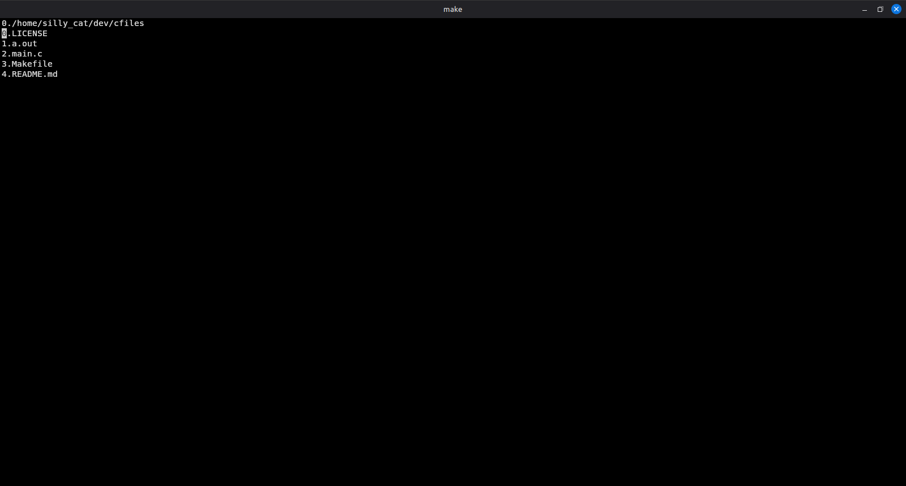

# cfiles
Simple ncurses based tui file manager written in C

Controlls:

q: quit program

d: delete file

n: rename file

y: yank file into clipboard

c: copy yanked file into the current directory

m: move yanked file into the current directory

k: cursor up

j: cursor down

l: into dir

h: exit dir
